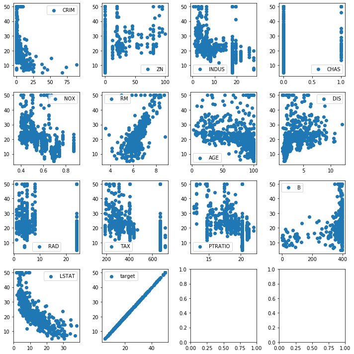

### Questions
- coefficient of determination
- application of covariance

### Objectives
YWBAT
* define linear regression
* describe what the various parts do in regards to the linreg equation
* calculate the error of a linear regression equation
* graph residuals and discuss heteroskedacicity

### Outline
* discuss the assumptions of Linear Regression
* show where ols is used in some high school math
* show an example of how to solve an 'OLS' problem using just numpy
* show how multicollinearity messes everything up
* get into some statsmodels ols 

### What is linear regression?
fitting a line y_hat = mx + b to some data points (x vs y), such that our line has minimal error in predicting y values.

Linear Regression - takes data (x and y values), plotting them on a graph.  Using y = mx + b to determine the slope and draw a line through the points.  Then determine the error. 

How one variable effects another variable.


### class discussion 

### When do we use it?
When there are two variables that are related

Almost never

### Let's discuss the assumptions of OLS first


```python
import numpy as np
import pandas as pd

import matplotlib.pyplot as plt
import seaborn as sns
```


```python
from sklearn.datasets import load_boston
```


```python
boston = load_boston()
```


```python
data = boston.data
target = boston.target
features = boston.feature_names
```


```python
df = pd.DataFrame(data, columns=features)

display(df.head())

df['target'] = target

display(df.head())


```


<div>
<style scoped>
    .dataframe tbody tr th:only-of-type {
        vertical-align: middle;
    }

    .dataframe tbody tr th {
        vertical-align: top;
    }

    .dataframe thead th {
        text-align: right;
    }
</style>
<table border="1" class="dataframe">
  <thead>
    <tr style="text-align: right;">
      <th></th>
      <th>CRIM</th>
      <th>ZN</th>
      <th>INDUS</th>
      <th>CHAS</th>
      <th>NOX</th>
      <th>RM</th>
      <th>AGE</th>
      <th>DIS</th>
      <th>RAD</th>
      <th>TAX</th>
      <th>PTRATIO</th>
      <th>B</th>
      <th>LSTAT</th>
    </tr>
  </thead>
  <tbody>
    <tr>
      <td>0</td>
      <td>0.00632</td>
      <td>18.0</td>
      <td>2.31</td>
      <td>0.0</td>
      <td>0.538</td>
      <td>6.575</td>
      <td>65.2</td>
      <td>4.0900</td>
      <td>1.0</td>
      <td>296.0</td>
      <td>15.3</td>
      <td>396.90</td>
      <td>4.98</td>
    </tr>
    <tr>
      <td>1</td>
      <td>0.02731</td>
      <td>0.0</td>
      <td>7.07</td>
      <td>0.0</td>
      <td>0.469</td>
      <td>6.421</td>
      <td>78.9</td>
      <td>4.9671</td>
      <td>2.0</td>
      <td>242.0</td>
      <td>17.8</td>
      <td>396.90</td>
      <td>9.14</td>
    </tr>
    <tr>
      <td>2</td>
      <td>0.02729</td>
      <td>0.0</td>
      <td>7.07</td>
      <td>0.0</td>
      <td>0.469</td>
      <td>7.185</td>
      <td>61.1</td>
      <td>4.9671</td>
      <td>2.0</td>
      <td>242.0</td>
      <td>17.8</td>
      <td>392.83</td>
      <td>4.03</td>
    </tr>
    <tr>
      <td>3</td>
      <td>0.03237</td>
      <td>0.0</td>
      <td>2.18</td>
      <td>0.0</td>
      <td>0.458</td>
      <td>6.998</td>
      <td>45.8</td>
      <td>6.0622</td>
      <td>3.0</td>
      <td>222.0</td>
      <td>18.7</td>
      <td>394.63</td>
      <td>2.94</td>
    </tr>
    <tr>
      <td>4</td>
      <td>0.06905</td>
      <td>0.0</td>
      <td>2.18</td>
      <td>0.0</td>
      <td>0.458</td>
      <td>7.147</td>
      <td>54.2</td>
      <td>6.0622</td>
      <td>3.0</td>
      <td>222.0</td>
      <td>18.7</td>
      <td>396.90</td>
      <td>5.33</td>
    </tr>
  </tbody>
</table>
</div>


<div>
<style scoped>
    .dataframe tbody tr th:only-of-type {
        vertical-align: middle;
    }

    .dataframe tbody tr th {
        vertical-align: top;
    }

    .dataframe thead th {
        text-align: right;
    }
</style>
<table border="1" class="dataframe">
  <thead>
    <tr style="text-align: right;">
      <th></th>
      <th>CRIM</th>
      <th>ZN</th>
      <th>INDUS</th>
      <th>CHAS</th>
      <th>NOX</th>
      <th>RM</th>
      <th>AGE</th>
      <th>DIS</th>
      <th>RAD</th>
      <th>TAX</th>
      <th>PTRATIO</th>
      <th>B</th>
      <th>LSTAT</th>
      <th>target</th>
    </tr>
  </thead>
  <tbody>
    <tr>
      <td>0</td>
      <td>0.00632</td>
      <td>18.0</td>
      <td>2.31</td>
      <td>0.0</td>
      <td>0.538</td>
      <td>6.575</td>
      <td>65.2</td>
      <td>4.0900</td>
      <td>1.0</td>
      <td>296.0</td>
      <td>15.3</td>
      <td>396.90</td>
      <td>4.98</td>
      <td>24.0</td>
    </tr>
    <tr>
      <td>1</td>
      <td>0.02731</td>
      <td>0.0</td>
      <td>7.07</td>
      <td>0.0</td>
      <td>0.469</td>
      <td>6.421</td>
      <td>78.9</td>
      <td>4.9671</td>
      <td>2.0</td>
      <td>242.0</td>
      <td>17.8</td>
      <td>396.90</td>
      <td>9.14</td>
      <td>21.6</td>
    </tr>
    <tr>
      <td>2</td>
      <td>0.02729</td>
      <td>0.0</td>
      <td>7.07</td>
      <td>0.0</td>
      <td>0.469</td>
      <td>7.185</td>
      <td>61.1</td>
      <td>4.9671</td>
      <td>2.0</td>
      <td>242.0</td>
      <td>17.8</td>
      <td>392.83</td>
      <td>4.03</td>
      <td>34.7</td>
    </tr>
    <tr>
      <td>3</td>
      <td>0.03237</td>
      <td>0.0</td>
      <td>2.18</td>
      <td>0.0</td>
      <td>0.458</td>
      <td>6.998</td>
      <td>45.8</td>
      <td>6.0622</td>
      <td>3.0</td>
      <td>222.0</td>
      <td>18.7</td>
      <td>394.63</td>
      <td>2.94</td>
      <td>33.4</td>
    </tr>
    <tr>
      <td>4</td>
      <td>0.06905</td>
      <td>0.0</td>
      <td>2.18</td>
      <td>0.0</td>
      <td>0.458</td>
      <td>7.147</td>
      <td>54.2</td>
      <td>6.0622</td>
      <td>3.0</td>
      <td>222.0</td>
      <td>18.7</td>
      <td>396.90</td>
      <td>5.33</td>
      <td>36.2</td>
    </tr>
  </tbody>
</table>
</div>


```python
df.shape
```


    (506, 14)


### Assumptions
Features - your columns in your matrix
1. Linear relationship between features and target
2. No multicollinearity of features with target

Residuals
- Residuals are normally distributed
- Residuals have homoskedacicity
- Exogeneity which is basically what the 2 above assumptions complete
- Errors are normally distributed amongst the errors as well


[Read more here](https://en.wikipedia.org/wiki/Ordinary_least_squares#Assumptions)

# Now to discuss multicollinearity

here's a system of equations

$$ \beta_1 \times 2 + \beta_2 \times -1 + \beta_3 \times 2 = 10 $$

$$ \beta_1 \times 1 + \beta_2 \times -2 + \beta_3 \times 1 = 8 $$

$$ \beta_1 \times 3 + \beta_2 \times -1 + \beta_3 \times 2 = 11 $$


if we solve this system we get a solution of $\beta_1 = 1, \beta_2 = -2, \beta_3 = 3$


#### formula derivation
<details>
    <summary>Really Important Derivation</summary>
    
$$ y = X\overline{\beta} $$

$$ X^T y = X^T X \overline{\beta} $$

$$ (X^T X)^{-1}X^T y = (X^T X)^{-1}X^T X \overline{\beta} $$


$$ (X^T X)^{-1}X^T y = \overline{\beta} $$ 

</details>


```python
np.identity(3) # the 1 equivalent in matrix spaces
```


    array([[1., 0., 0.],
           [0., 1., 0.],
           [0., 0., 1.]])


```python
# let's solve this using numpy
X = np.array([[2, -1, 2], [1, -2, 1], [3, -1, 2]]) # features
y = np.array([[10], [8], [11]]) # targets

display(X)
display(y)
```


    array([[ 2, -1,  2],
           [ 1, -2,  1],
           [ 3, -1,  2]])


    array([[10],
           [ 8],
           [11]])


```python
X.shape, y.shape
```


    ((3, 3), (3, 1))


```python
display(X.T) # this is X transpose
display(X)

# The big question is does XTX inverse even exist?
```


    array([[ 2,  1,  3],
           [-1, -2, -1],
           [ 2,  1,  2]])


    array([[ 2, -1,  2],
           [ 1, -2,  1],
           [ 3, -1,  2]])


```python
xtx = X.T.dot(X)
xtx # this is XT * X 
```


    array([[14, -7, 11],
           [-7,  6, -6],
           [11, -6,  9]])


```python
# Now to calcualte the inverse of XTX
xtxinv = np.linalg.inv(xtx)
xtxinv
```


    array([[ 2.        , -0.33333333, -2.66666667],
           [-0.33333333,  0.55555556,  0.77777778],
           [-2.66666667,  0.77777778,  3.88888889]])


```python
# (XTX)^-1 * XT * y = beta terms
# beta = xtxinv * XT * y

betas = xtxinv.dot(X.T).dot(y)

betas
```


    array([[ 1.],
           [-2.],
           [ 3.]])


so this is cool!!!! We can solve systems of equations without any machine learning, just using math! 

### But what happens if we introduce multicollinearity? 


```python
X = np.array([[2, 7.95, 2], [1, 4.01, 1], [3, 11.97, 2]]) # features with high correlation
y = np.array([[10], [8], [11]]) # same target

display(X) # notice the multicollinearity of X's columns 1 and 2
display(y)
```


    array([[ 2.  ,  7.95,  2.  ],
           [ 1.  ,  4.01,  1.  ],
           [ 3.  , 11.97,  2.  ]])


    array([[10],
           [ 8],
           [11]])


```python
# how does this effect the inverse of XTX? 
xtx = X.T.dot(X)
xtxinv = np.linalg.inv(xtx)


display(xtx)
display(xtxinv)
```


    array([[ 14.    ,  55.82  ,  11.    ],
           [ 55.82  , 222.5635,  43.85  ],
           [ 11.    ,  43.85  ,   9.    ]])


    array([[ 1.63773469e+04, -4.08775510e+03, -1.00306122e+02],
           [-4.08775510e+03,  1.02040816e+03,  2.44897959e+01],
           [-1.00306122e+02,  2.44897959e+01,  3.38775510e+00]])


```python
xtxinv.dot(X.T).dot(y) # these are our beta terms
```


    array([[-343.57142857],
           [  85.71428571],
           [   7.85714286]])


In general having multicollinearity creates a space XTX that has no inverse.


This means the entire problem is unsolvable. 

**Generate x data**

### Let's investigate the assumptions of OLS


```python
# eyeball test

this, that = plt.subplots(nrows=4, ncols=4, figsize=(10, 10))

for index, ax in enumerate(that.flatten()):
    try:
        vals = df[df.columns[index]]
        ax.scatter(vals, df.target, label=df.columns[index])
        # ax.set_title(df.columns[index])
        ax.legend()
    except:
        continue

plt.tight_layout()
plt.show()
```





### use Pearson correlation to test for linearity


```python
col_corrs = []
for column in df.columns:
    print(column)
    print(np.corrcoef(df[column], df.target)[0][1])
    col_corrs.append(np.corrcoef(df[column], df.target)[0][1])
    print("-"*20)
```

    CRIM
    -0.3883046085868114
    --------------------
    ZN
    0.3604453424505433
    --------------------
    INDUS
    -0.4837251600283728
    --------------------
    CHAS
    0.17526017719029818
    --------------------
    NOX
    -0.4273207723732824
    --------------------
    RM
    0.695359947071539
    --------------------
    AGE
    -0.37695456500459606
    --------------------
    DIS
    0.24992873408590388
    --------------------
    RAD
    -0.38162623063977746
    --------------------
    TAX
    -0.46853593356776696
    --------------------
    PTRATIO
    -0.5077866855375615
    --------------------
    B
    0.33346081965706637
    --------------------
    LSTAT
    -0.7376627261740148
    --------------------
    target
    1.0
    --------------------


```python
plt.figure(figsize=(8, 5))
plt.bar(df.columns, np.abs(col_corrs))
plt.xticks(rotation=70)
plt.show()
```


### Now let's investigate multicollinearity


```python
corr = df.corr()

plt.figure(figsize=(10, 10))
sns.heatmap(data=corr, annot=True, fmt='0.2g', cmap=sns.color_palette('Blues'))
plt.tight_layout()
plt.show()
```


```python

```


```python
# 50 values between 0 and 100 including 0 and 100

x_vals = np.linspace(0, 100, 51)
```


```python
x_vals
```


    array([  0.,   2.,   4.,   6.,   8.,  10.,  12.,  14.,  16.,  18.,  20.,
            22.,  24.,  26.,  28.,  30.,  32.,  34.,  36.,  38.,  40.,  42.,
            44.,  46.,  48.,  50.,  52.,  54.,  56.,  58.,  60.,  62.,  64.,
            66.,  68.,  70.,  72.,  74.,  76.,  78.,  80.,  82.,  84.,  86.,
            88.,  90.,  92.,  94.,  96.,  98., 100.])


**Generate y data**


```python
# y = mx + b + error, slope = m and bias = b

# choosing a random integer between 20 and 50 for a slope
slope = np.random.randint(20, 50)


# generates normal distribution with mu=100 sigma=200 n_points=50
errors = np.random.normal(300, 500, 51)

# bias ~ intercept
# random integer between 20 and 200
bias = np.random.randint(20, 200)
```


```python
# y = b + mx + errors
y_vals = bias + slope*x_vals + errors
```


```python
plt.figure(figsize=(8, 5))
plt.scatter(x_vals, y_vals)
plt.xlabel("x values")
plt.ylabel("y values")
plt.title("data points")
plt.show()
```

## Compare Guessing to Using Statsmodels

### Let's check the correlation coefficient


```python
np.corrcoef(x_vals, y_vals)
```


```python
### let's just guess a slope
slope_guess = 30
bias_guess = 0
```


```python
### this yields a y_hat array of
y_hat = bias_guess + slope_guess*x_vals
y_hat
```


```python
plt.figure(figsize=(8, 5))
plt.scatter(x_vals, y_vals)
plt.plot(x_vals, y_hat, c='r', label='y-hat')
plt.xlabel("x values")
plt.ylabel("y values")
plt.title("data points")
plt.legend()
plt.show()
```

### RMSE equation


```python
### Yikes! How bad is this?

### Let's create our RMSE equations

def RMSE1(y_true, y_pred):
    num = np.sum((y_pred - np.mean(y_true))**2)
    den = np.sum((y_true - np.mean(y_true))**2)
    return num / den

def RMSE2(y_true, y_pred):
    num = np.sum((y_true - y_pred)**2)
    den = np.sum((y_true - y_true.mean())**2)
    return 1 - num / den
```


```python
RMSE1(y_vals, y_hat)
```


```python
RMSE2(y_vals, y_hat)
```

### which one will python use? Let's import from sklearn.metrics


```python
from sklearn.metrics import r2_score
```


```python
r2_score(y_vals, y_hat)
```

### now, how can we do this using statsmodels?


```python
import statsmodels.api as sm # very standard
```


```python
x_vals
```


```python
x = sm.add_constant(x_vals) 
# adding a constant to estimate a beta_0 value (constant value) for your equation
```


```python
x[:10]
```


```python
linreg = sm.OLS(y_vals, x).fit()
```


```python
summary = linreg.summary()
summary
```

### Let's interpret this!
* R-squared - 71% so we can explain 71% of the variance
* const: - 165.2947 - y-intercept - pvalue=0.279 this is probably random
* x1: coeff - 29.1315 - slope - pvalue=0.000 this is not random
* skewedness: -0.997 - Skewed to the left by an amount
* kurtosis: 4.741 - data is not centered on the mean 


```python
# plot residuals
residuals = y_hat - y_vals
```


```python
# plot for heteroskedacicity
def plot_residuals(residuals, ylim=[-1500, 1500]):
    xis = np.linspace(0, 1, len(residuals))
    plt.scatter(xis, residuals)
    plt.hlines(y=0, xmin=0, xmax=1, colors='r')
    plt.ylim(ylim)
    plt.show()
    
    plt.hist(residuals, bins=20)
    plt.show()
```


```python
plot_residuals(residuals)
```


```python
# how close were we?
bias, slope
```


```python
linreg.params
```


```python
ols_bias, ols_slope = linreg.params
ols_y_hat = ols_bias + ols_slope*x_vals
ols_slope, ols_bias
```


```python
plt.scatter(x_vals, y_vals)
plt.plot(x_vals, ols_y_hat, c='r', label='ols y-hat')
plt.xlabel("x values")
plt.ylabel("y values")
plt.title("data points")
plt.legend()
plt.show()
```


```python
sm_residuals = linreg.resid
```


```python
plot_residuals(sm_residuals, ylim=[-2000, 2000])
```


```python

```


```python

```


```python

```


```python
best_y_hat = bias + slope*x_vals
```


```python
plt.scatter(x_vals, y_vals)
plt.plot(x_vals, best_y_hat, c='r', label="'best' y-hat")
plt.xlabel("x values")
plt.ylabel("y values")
plt.title("data points")
plt.legend()
plt.show()
```


```python
r2_score(y_vals, ols_y_hat), r2_score(y_vals, best_y_hat)
```


```python
residuals_ols = y_vals - ols_y_hat
residuals_best = y_vals - best_y_hat
```


```python
plt.scatter(x_vals, residuals_ols)
plt.title("Residuals from OLS")
plt.hlines(xmin=0, xmax=100, color='r', y=0)
plt.ylim([-2000, 2000])
plt.show()

plt.scatter(x_vals, residuals_best)
plt.title("Residuals from 'actual betas' fit")
plt.hlines(xmin=0, xmax=100, color='r', y=0)
plt.ylim([-2000, 2000])
plt.show()
```


```python
plt.hist(residuals_best, bins=20)
plt.title("residuals for 'original line'")
plt.show()

plt.hist(residuals_ols, bins=20)
plt.title("residuals for ols model")
plt.show()
```

### Estimation using the $\hat{m}$ approxmiation
$$\hat{m} = \rho \frac{\sigma_y}{\sigma_x}$$

$$\hat{m} = \frac{\overline{x}\times\overline{y}-\overline{xy}}{\big(\overline{x}\big)^2-\overline{x^2}}$$


```python
# formula 1
rho = np.corrcoef(x_vals, y_vals)[0, 1]
num = y_vals.std()
den = x_vals.std()

m_hat = rho * num/den
m_hat
```


```python
# formula 2
num = x_vals.mean()*y_vals.mean() - np.mean(x_vals*y_vals)
den = x_vals.mean()**2 - np.mean(x_vals**2)
m_hat = num/den
m_hat
```


```python
# Let's try this slope out!!!
```


```python
y_trial.shape
```


```python
y_trial = m_hat * x_vals
r2_score(y_vals, y_trial)
```


```python
plt.scatter(x_vals, y_vals)
plt.plot(x_vals, y_trial, c='r')
plt.xlabel("x values")
plt.ylabel("y values")
plt.title("data points")
plt.show()
```

# Though our r2 is nice and high at 0.84...
We should be careful because our line sits under most of our data, we can see this through a residual plot


```python
residuals_from_trial = y_trial - y_vals
```


```python
plot_residuals(residuals_from_trial)
```

### what did we learn?
