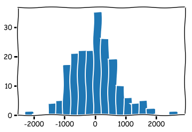

### Questions
* Can we get an interpretation of statistical equations
    * OLS derivation
    * Variance and Covariance
    * Correlation Coefficient
* Which models best perform in certain scenarios? 
    * How do we learn the methods to perform high level skills
    * Discuss pros and cons of models

### Objectives
YWBAT
* define linear regression
* describe what the various parts do in regards to the linreg equation
* calculate the error of a linear regression equation
* graph residuals and discuss heteroskedacicityj
* interpret residuals of an OLS model

### Outline
* discuss linear regression and it's use cases
* mock up some data
* run ols on it
    * statsmodels
    * score using r2
    * score r2 by hand comparing the 2 equations
* summarize our sm ols summary

### What is linear regression?

#### Finding the 'Best Fit' Line
    * Having normal residuals
    * Having homoskecadicity in residuals (blob)
    * Centered on zero

fitting a line y_hat = mx + b to some data points (x vs y), such that our line has minimal error in predicting y values.

Linear Regression - takes data (x and y values), plotting them on a graph.  Using y = mx + b to determine the slope and draw a line through the points.  Then determine the error. 

How one variable effects another variable.


### When do we use it?
When there are two variables that are related

* In business
    * Handy for making predictions
    * Compare independent (X) to dependent (Y) variable
        * it's interpretable using the coefficient of your independent variables


### Let's make an example with some data!!!!!


```python
import numpy as np
import matplotlib.pyplot as plt
import seaborn as sns

# setting random seed -> makes results reproducible
np.random.seed(42)

# stylize our plots to be like 'xkcd'
plt.xkcd()
```


    <matplotlib.pyplot.xkcd.<locals>.dummy_ctx at 0x1a24d08ef0>


**Generate x data**


```python
# 200 values between 0 and 100 including 0 and 100
x_vals = np.linspace(0, 100, 200)
```


```python
x_vals[:5]
```


    array([0.        , 0.50251256, 1.00502513, 1.50753769, 2.01005025])


**Generate a slope and bias (intercept)**


```python
# y = mx + b + error, slope = m and bias = b

# choosing a random integer between 20 and 50 for a slope
coefficient = np.random.randint(20, 50)


# generates normal distribution with mu=100 sigma=200 n_points=50
noise = np.random.normal(300, 700, 200)

# bias ~ intercept
# random integer between 20 and 200
constant = np.random.randint(20, 200)
```

**Generate y data**


```python
# y = b + mx + errors
y_vals = constant + coefficient*x_vals + noise
```


```python
plt.figure(figsize=(8, 5))
plt.scatter(x_vals, y_vals)
plt.xlabel("x values")
plt.ylabel("y values")
plt.title("data points")
plt.show()
```


## Compare Guessing to Using Statsmodels

### Let's check the correlation coefficient


```python
np.corrcoef(x_vals, y_vals)
```


    array([[1.        , 0.87362722],
           [0.87362722, 1.        ]])


### Let's attempt to guess the constant and coefficient


```python
### let's just guess a slope
coefficient_guess = 30
constant_guess = 0
```


```python
### this yields a y_hat array of
y_hat = constant_guess + coefficient_guess*x_vals
y_hat
```


    array([   0.        ,   15.07537688,   30.15075377,   45.22613065,
             60.30150754,   75.37688442,   90.45226131,  105.52763819,
            120.60301508,  135.67839196,  150.75376884,  165.82914573,
            180.90452261,  195.9798995 ,  211.05527638,  226.13065327,
            241.20603015,  256.28140704,  271.35678392,  286.4321608 ,
            301.50753769,  316.58291457,  331.65829146,  346.73366834,
            361.80904523,  376.88442211,  391.95979899,  407.03517588,
            422.11055276,  437.18592965,  452.26130653,  467.33668342,
            482.4120603 ,  497.48743719,  512.56281407,  527.63819095,
            542.71356784,  557.78894472,  572.86432161,  587.93969849,
            603.01507538,  618.09045226,  633.16582915,  648.24120603,
            663.31658291,  678.3919598 ,  693.46733668,  708.54271357,
            723.61809045,  738.69346734,  753.76884422,  768.84422111,
            783.91959799,  798.99497487,  814.07035176,  829.14572864,
            844.22110553,  859.29648241,  874.3718593 ,  889.44723618,
            904.52261307,  919.59798995,  934.67336683,  949.74874372,
            964.8241206 ,  979.89949749,  994.97487437, 1010.05025126,
           1025.12562814, 1040.20100503, 1055.27638191, 1070.35175879,
           1085.42713568, 1100.50251256, 1115.57788945, 1130.65326633,
           1145.72864322, 1160.8040201 , 1175.87939698, 1190.95477387,
           1206.03015075, 1221.10552764, 1236.18090452, 1251.25628141,
           1266.33165829, 1281.40703518, 1296.48241206, 1311.55778894,
           1326.63316583, 1341.70854271, 1356.7839196 , 1371.85929648,
           1386.93467337, 1402.01005025, 1417.08542714, 1432.16080402,
           1447.2361809 , 1462.31155779, 1477.38693467, 1492.46231156,
           1507.53768844, 1522.61306533, 1537.68844221, 1552.7638191 ,
           1567.83919598, 1582.91457286, 1597.98994975, 1613.06532663,
           1628.14070352, 1643.2160804 , 1658.29145729, 1673.36683417,
           1688.44221106, 1703.51758794, 1718.59296482, 1733.66834171,
           1748.74371859, 1763.81909548, 1778.89447236, 1793.96984925,
           1809.04522613, 1824.12060302, 1839.1959799 , 1854.27135678,
           1869.34673367, 1884.42211055, 1899.49748744, 1914.57286432,
           1929.64824121, 1944.72361809, 1959.79899497, 1974.87437186,
           1989.94974874, 2005.02512563, 2020.10050251, 2035.1758794 ,
           2050.25125628, 2065.32663317, 2080.40201005, 2095.47738693,
           2110.55276382, 2125.6281407 , 2140.70351759, 2155.77889447,
           2170.85427136, 2185.92964824, 2201.00502513, 2216.08040201,
           2231.15577889, 2246.23115578, 2261.30653266, 2276.38190955,
           2291.45728643, 2306.53266332, 2321.6080402 , 2336.68341709,
           2351.75879397, 2366.83417085, 2381.90954774, 2396.98492462,
           2412.06030151, 2427.13567839, 2442.21105528, 2457.28643216,
           2472.36180905, 2487.43718593, 2502.51256281, 2517.5879397 ,
           2532.66331658, 2547.73869347, 2562.81407035, 2577.88944724,
           2592.96482412, 2608.04020101, 2623.11557789, 2638.19095477,
           2653.26633166, 2668.34170854, 2683.41708543, 2698.49246231,
           2713.5678392 , 2728.64321608, 2743.71859296, 2758.79396985,
           2773.86934673, 2788.94472362, 2804.0201005 , 2819.09547739,
           2834.17085427, 2849.24623116, 2864.32160804, 2879.39698492,
           2894.47236181, 2909.54773869, 2924.62311558, 2939.69849246,
           2954.77386935, 2969.84924623, 2984.92462312, 3000.        ])


```python
plt.figure(figsize=(8, 5))
# scatter of the original data
plt.scatter(x_vals, y_vals)

# line plot of y_hat (guessed data)
plt.plot(x_vals, y_hat, c='r', label='y-hat')

plt.xlabel("x values")
plt.ylabel("y values")
plt.title("data points")
plt.legend()
plt.show()
```


### Summary of Guess
* Most of our points are above the line
* Big Residuals
* Uneven Residuals, they get larger as X increases
* Only a handful of points are near the linef

### Let's calculate residuals


```python
residuals = y_vals - y_hat
```


```python
# what should we see in a distribution of our residuals? 

plt.hist(residuals, bins=20, alpha=0.5)
plt.show()
```


```python
# let's do a plot for homoskedacicity

plt.scatter(x_vals, residuals)
plt.hlines(y=0, xmin=0, xmax=100, colors='r', label='zero line')
plt.title("Homoskedacicity Plot\nOf Residuals")
plt.show()
```


### Summary
* Residuals go up, trending, which is bad
* Not centered on zero
* Not a blob

### RMSE equation


```python
### Yikes! How bad is this?

### Let's create our RMSE equations

def RMSE1(y_true, y_pred):
    num = np.sum((y_pred - y_true.mean())**2)
    den = np.sum((y_true - y_true.mean())**2)
    return num/den

def RMSE2(y_true, y_pred):
    num = np.sum((y_true - y_pred)**2)
    den = np.sum((y_true - y_true.mean())**2)
    return 1 - num/den
```


```python
RMSE1(y_vals, y_hat)
```


    1.0132904985202853


```python
RMSE2(y_vals, y_hat)
```


    0.027558734993398892


### which one will python use? Let's import from sklearn.metrics


```python
from sklearn.metrics import r2_score
```


```python
r2_score(y_vals, y_hat)
```


    0.027558734993398892


### now, how can we do this using statsmodels?


```python
import statsmodels.api as sm # very standard
```


```python
print(x_vals[:10])
```

    [0.         0.50251256 1.00502513 1.50753769 2.01005025 2.51256281
     3.01507538 3.51758794 4.0201005  4.52261307]


```python
# sm.add_constant is used when you want to predict a 
# constant term for your OLS equation
x = sm.add_constant(x_vals) 
# adding a constant to estimate a beta_0 value (constant value) for your equation
```


```python
print(x[:10])
```

    [[1.         0.        ]
     [1.         0.50251256]
     [1.         1.00502513]
     [1.         1.50753769]
     [1.         2.01005025]
     [1.         2.51256281]
     [1.         3.01507538]
     [1.         3.51758794]
     [1.         4.0201005 ]
     [1.         4.52261307]]


```python
# predict a b0 and b1
linreg = sm.OLS(y_vals, x).fit()
```


```python
summary = linreg.summary()
summary
```


<table class="simpletable">
<caption>OLS Regression Results</caption>
<tr>
  <th>Dep. Variable:</th>            <td>y</td>        <th>  R-squared:         </th> <td>   0.763</td>
</tr>
<tr>
  <th>Model:</th>                   <td>OLS</td>       <th>  Adj. R-squared:    </th> <td>   0.762</td>
</tr>
<tr>
  <th>Method:</th>             <td>Least Squares</td>  <th>  F-statistic:       </th> <td>   638.2</td>
</tr>
<tr>
  <th>Date:</th>             <td>Thu, 17 Oct 2019</td> <th>  Prob (F-statistic):</th> <td>7.42e-64</td>
</tr>
<tr>
  <th>Time:</th>                 <td>11:46:31</td>     <th>  Log-Likelihood:    </th> <td> -1597.1</td>
</tr>
<tr>
  <th>No. Observations:</th>      <td>   200</td>      <th>  AIC:               </th> <td>   3198.</td>
</tr>
<tr>
  <th>Df Residuals:</th>          <td>   198</td>      <th>  BIC:               </th> <td>   3205.</td>
</tr>
<tr>
  <th>Df Model:</th>              <td>     1</td>      <th>                     </th>     <td> </td>   
</tr>
<tr>
  <th>Covariance Type:</th>      <td>nonrobust</td>    <th>                     </th>     <td> </td>   
</tr>
</table>
<table class="simpletable">
<tr>
    <td></td>       <th>coef</th>     <th>std err</th>      <th>t</th>      <th>P>|t|</th>  <th>[0.025</th>    <th>0.975]</th>  
</tr>
<tr>
  <th>const</th> <td>  485.7476</td> <td>  100.672</td> <td>    4.825</td> <td> 0.000</td> <td>  287.220</td> <td>  684.275</td>
</tr>
<tr>
  <th>x1</th>    <td>   43.9963</td> <td>    1.742</td> <td>   25.263</td> <td> 0.000</td> <td>   40.562</td> <td>   47.431</td>
</tr>
</table>
<table class="simpletable">
<tr>
  <th>Omnibus:</th>       <td> 7.154</td> <th>  Durbin-Watson:     </th> <td>   2.207</td>
</tr>
<tr>
  <th>Prob(Omnibus):</th> <td> 0.028</td> <th>  Jarque-Bera (JB):  </th> <td>   7.827</td>
</tr>
<tr>
  <th>Skew:</th>          <td> 0.320</td> <th>  Prob(JB):          </th> <td>  0.0200</td>
</tr>
<tr>
  <th>Kurtosis:</th>      <td> 3.729</td> <th>  Cond. No.          </th> <td>    115.</td>
</tr>
</table><br/><br/>Warnings:<br/>[1] Standard Errors assume that the covariance matrix of the errors is correctly specified.


### Let's interpret this!
* R-squared - 76% so we can explain 71% of the variance
* const: - 485.7476 - y-intercept
* x1: coeff - 43.9963 slope
* skewedness: 0.320 - Skewed to the right by a very small amount
* kurtosis: 3.729 - residuals contain outliers 


```python
residuals = linreg.resid
```


```python
# plot for heteroskedacicity
def plot_residuals(residuals, ylim=[-1500, 1500]):
    xis = np.linspace(0, 1, len(residuals))
    plt.scatter(xis, residuals)
    plt.hlines(y=0, xmin=0, xmax=1, colors='r')
    plt.ylim(ylim)
    plt.show()
    
    plt.hist(residuals, bins=20)
    plt.show()
```


```python
plot_residuals(residuals)
```





* these residuals are a blob
* look symmetrical about the zero line
* normal distribution of residuals, centered on 0
    * we have some outliers


```python
# how do we get parameters

linreg.params
```


    array([485.74760643,  43.99625785])


```python
params = linreg.params
```


```python
x[:3]
```


    array([[1.        , 0.        ],
           [1.        , 0.50251256],
           [1.        , 1.00502513]])


```python
# What does this do? 
# 
new_yhats = x.dot(params)
```


```python
plt.figure(figsize=(8, 5))
plt.scatter(x_vals, y_vals, c='b', alpha=0.5)
plt.plot(x_vals, new_yhats, c='r', label='predicted y values')
plt.legend()
plt.show()
```


### What was learned? 
* homoscedasticity
    * how to pronounce it
    * relevant to the residuals of an OLS model
    * residuals need to be homoscedasticitous
    * Skewness and Kurtosis
    * Jacque-Bera 
* `linreg.summary()` from statsmodels.api 
    * gives you all information on your OLS model
* what does it mean to be a best fit line? 
    * distribution of residuals should be centered on 0
    * distribution of residuals should be normal
