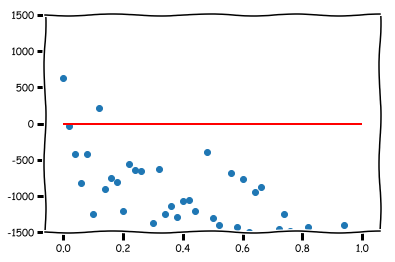
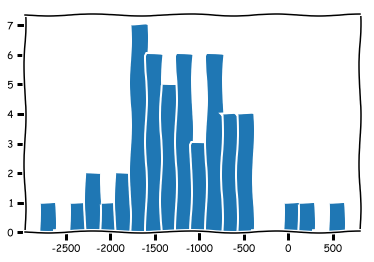
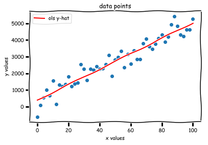
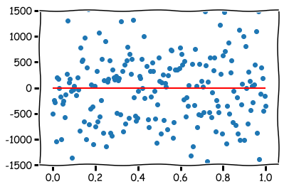
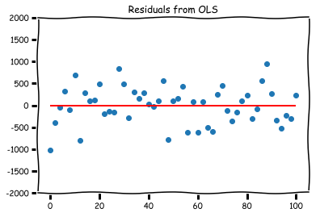
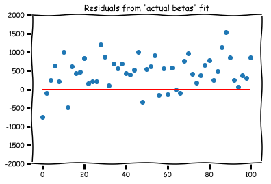
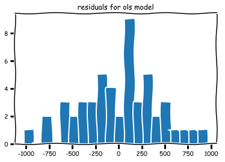

### Questions
* normalization and standardization
* finding residuals
* statsmodels
* r2 score - 2 equations

### Objectives
YWBAT
* define linear regression
* describe what the various parts do in regards to the linreg equation
* calculate the error of a linear regression equation
* graph residuals and discuss heteroskedacicity

### Outline
* discuss linear regression and it's use cases
* mock up some data
* run ols on it
    * statsmodels
    * score using r2
    * score r2 by hand comparing the 2 equations
* summarize our sm ols summary

### What is linear regression?
fitting a line y_hat = mx + b to some data points (x vs y), such that our line has minimal error in predicting y values.

Linear Regression - takes data (x and y values), plotting them on a graph.  Using y = mx + b to determine the slope and draw a line through the points.  Then determine the error. 

How one variable effects another variable.


### When do we use it?
When there are two variables that are related

Almost never

### Let's make an example with some data!!!!!


```python
import numpy as np
import matplotlib.pyplot as plt
import seaborn as sns
plt.xkcd()
```


    <contextlib._GeneratorContextManager at 0x11469d198>


**Generate x data**


```python
# 50 values between 0 and 100 including 0 and 100
x_vals = np.linspace(0, 100, 51)
```


```python
x_vals
```


    array([  0.,   2.,   4.,   6.,   8.,  10.,  12.,  14.,  16.,  18.,  20.,
            22.,  24.,  26.,  28.,  30.,  32.,  34.,  36.,  38.,  40.,  42.,
            44.,  46.,  48.,  50.,  52.,  54.,  56.,  58.,  60.,  62.,  64.,
            66.,  68.,  70.,  72.,  74.,  76.,  78.,  80.,  82.,  84.,  86.,
            88.,  90.,  92.,  94.,  96.,  98., 100.])


**Generate y data**


```python
# y = mx + b + error, slope = m and bias = b

# choosing a random integer between 20 and 50 for a slope
slope = np.random.randint(20, 50)


# generates normal distribution with mu=100 sigma=200 n_points=50
errors = np.random.normal(300, 500, 51)

# bias ~ intercept
# random integer between 20 and 200
bias = np.random.randint(20, 200)
```


```python
# y = b + mx + errors
y_vals = bias + slope*x_vals + errors
```


```python
plt.figure(figsize=(8, 5))
plt.scatter(x_vals, y_vals)
plt.xlabel("x values")
plt.ylabel("y values")
plt.title("data points")
plt.show()
```


## Compare Guessing to Using Statsmodels

### Let's check the correlation coefficient


```python
np.corrcoef(x_vals, y_vals)
```


    array([[1.        , 0.84805296],
           [0.84805296, 1.        ]])


```python
### let's just guess a slope
slope_guess = 30
bias_guess = 0
```


```python
### this yields a y_hat array of
y_hat = bias_guess + slope_guess*x_vals
y_hat
```


    array([   0.,   60.,  120.,  180.,  240.,  300.,  360.,  420.,  480.,
            540.,  600.,  660.,  720.,  780.,  840.,  900.,  960., 1020.,
           1080., 1140., 1200., 1260., 1320., 1380., 1440., 1500., 1560.,
           1620., 1680., 1740., 1800., 1860., 1920., 1980., 2040., 2100.,
           2160., 2220., 2280., 2340., 2400., 2460., 2520., 2580., 2640.,
           2700., 2760., 2820., 2880., 2940., 3000.])


```python
plt.figure(figsize=(8, 5))
plt.scatter(x_vals, y_vals)
plt.plot(x_vals, y_hat, c='r', label='y-hat')
plt.xlabel("x values")
plt.ylabel("y values")
plt.title("data points")
plt.legend()
plt.show()
```


### RMSE equation


```python
### Yikes! How bad is this?

### Let's create our RMSE equations

def RMSE1(y_true, y_pred):
    num = np.sum((y_pred - np.mean(y_true))**2)
    den = np.sum((y_true - np.mean(y_true))**2)
    return num / den

def RMSE2(y_true, y_pred):
    num = np.sum((y_true - y_pred)**2)
    den = np.sum((y_true - y_true.mean())**2)
    return 1 - num / den
```


```python
RMSE1(y_vals, y_hat)
```


    0.7772369138460854


```python
RMSE2(y_vals, y_hat)
```


    0.7040310035161832


### which one will python use? Let's import from sklearn.metrics


```python
from sklearn.metrics import r2_score
```


```python
r2_score(y_vals, y_hat)
```


    0.7040310035161832


### now, how can we do this using statsmodels?


```python
import statsmodels.api as sm # very standard
```


```python
x_vals
```


    array([  0.,   2.,   4.,   6.,   8.,  10.,  12.,  14.,  16.,  18.,  20.,
            22.,  24.,  26.,  28.,  30.,  32.,  34.,  36.,  38.,  40.,  42.,
            44.,  46.,  48.,  50.,  52.,  54.,  56.,  58.,  60.,  62.,  64.,
            66.,  68.,  70.,  72.,  74.,  76.,  78.,  80.,  82.,  84.,  86.,
            88.,  90.,  92.,  94.,  96.,  98., 100.])


```python
x = sm.add_constant(x_vals) 
# adding a constant to estimate a beta_0 value (constant value) for your equation
```


```python
x[:10]
```


    array([[ 1.,  0.],
           [ 1.,  2.],
           [ 1.,  4.],
           [ 1.,  6.],
           [ 1.,  8.],
           [ 1., 10.],
           [ 1., 12.],
           [ 1., 14.],
           [ 1., 16.],
           [ 1., 18.]])


```python
linreg = sm.OLS(y_vals, x).fit()
```


```python
summary = linreg.summary()
summary
```


<table class="simpletable">
<caption>OLS Regression Results</caption>
<tr>
  <th>Dep. Variable:</th>            <td>y</td>        <th>  R-squared:         </th> <td>   0.719</td>
</tr>
<tr>
  <th>Model:</th>                   <td>OLS</td>       <th>  Adj. R-squared:    </th> <td>   0.713</td>
</tr>
<tr>
  <th>Method:</th>             <td>Least Squares</td>  <th>  F-statistic:       </th> <td>   125.5</td>
</tr>
<tr>
  <th>Date:</th>             <td>Thu, 23 May 2019</td> <th>  Prob (F-statistic):</th> <td>4.06e-15</td>
</tr>
<tr>
  <th>Time:</th>                 <td>14:42:09</td>     <th>  Log-Likelihood:    </th> <td> -392.85</td>
</tr>
<tr>
  <th>No. Observations:</th>      <td>    51</td>      <th>  AIC:               </th> <td>   789.7</td>
</tr>
<tr>
  <th>Df Residuals:</th>          <td>    49</td>      <th>  BIC:               </th> <td>   793.6</td>
</tr>
<tr>
  <th>Df Model:</th>              <td>     1</td>      <th>                     </th>     <td> </td>   
</tr>
<tr>
  <th>Covariance Type:</th>      <td>nonrobust</td>    <th>                     </th>     <td> </td>   
</tr>
</table>
<table class="simpletable">
<tr>
    <td></td>       <th>coef</th>     <th>std err</th>      <th>t</th>      <th>P>|t|</th>  <th>[0.025</th>    <th>0.975]</th>  
</tr>
<tr>
  <th>const</th> <td>  165.2947</td> <td>  150.885</td> <td>    1.096</td> <td> 0.279</td> <td> -137.920</td> <td>  468.509</td>
</tr>
<tr>
  <th>x1</th>    <td>   29.1315</td> <td>    2.600</td> <td>   11.203</td> <td> 0.000</td> <td>   23.906</td> <td>   34.357</td>
</tr>
</table>
<table class="simpletable">
<tr>
  <th>Omnibus:</th>       <td>13.145</td> <th>  Durbin-Watson:     </th> <td>   2.022</td>
</tr>
<tr>
  <th>Prob(Omnibus):</th> <td> 0.001</td> <th>  Jarque-Bera (JB):  </th> <td>  14.891</td>
</tr>
<tr>
  <th>Skew:</th>          <td>-0.997</td> <th>  Prob(JB):          </th> <td>0.000584</td>
</tr>
<tr>
  <th>Kurtosis:</th>      <td> 4.741</td> <th>  Cond. No.          </th> <td>    114.</td>
</tr>
</table>


### Let's interpret this!
* R-squared - 71% so we can explain 71% of the variance
* const: - 165.2947 - y-intercept - pvalue=0.279 this is probably random
* x1: coeff - 29.1315 - slope - pvalue=0.000 this is not random
* skewedness: -0.997 - Skewed to the left by an amount
* kurtosis: 4.741 - data is not centered on the mean 


```python
# plot residuals
residuals = y_hat - y_vals
```


```python
# plot for heteroskedacicity
def plot_residuals(residuals, ylim=[-1500, 1500]):
    xis = np.linspace(0, 1, len(residuals))
    plt.scatter(xis, residuals)
    plt.hlines(y=0, xmin=0, xmax=1, colors='r')
    plt.ylim(ylim)
    plt.show()
    
    plt.hist(residuals, bins=20)
    plt.show()
```


```python
plot_residuals(residuals)
```








```python
# how close were we?
bias, slope
```


    (36, 28)


```python
linreg.params
```


    array([165.29472623,  29.13154899])


```python
ols_bias, ols_slope = linreg.params
ols_y_hat = ols_bias + ols_slope*x_vals
ols_slope, ols_bias
```


    (29.131548985125946, 165.29472623494996)


```python
plt.scatter(x_vals, y_vals)
plt.plot(x_vals, ols_y_hat, c='r', label='ols y-hat')
plt.xlabel("x values")
plt.ylabel("y values")
plt.title("data points")
plt.legend()
plt.show()
```





```python
sm_residuals = linreg.resid
```


```python
plot_residuals(sm_residuals, ylim=[-2000, 2000])
```


```python
best_y_hat = bias + slope*x_vals
```


```python
plt.scatter(x_vals, y_vals)
plt.plot(x_vals, best_y_hat, c='r', label="'best' y-hat")
plt.xlabel("x values")
plt.ylabel("y values")
plt.title("data points")
plt.legend()
plt.show()
```





```python
r2_score(y_vals, ols_y_hat), r2_score(y_vals, best_y_hat)
```


    (0.71919381491224, 0.6843259397513707)


```python
residuals_ols = y_vals - ols_y_hat
residuals_best = y_vals - best_y_hat
```


```python
plt.scatter(x_vals, residuals_ols)
plt.title("Residuals from OLS")
plt.hlines(xmin=0, xmax=100, color='r', y=0)
plt.ylim([-2000, 2000])
plt.show()

plt.scatter(x_vals, residuals_best)
plt.title("Residuals from 'actual betas' fit")
plt.hlines(xmin=0, xmax=100, color='r', y=0)
plt.ylim([-2000, 2000])
plt.show()
```








```python
plt.hist(residuals_best, bins=20)
plt.title("residuals for 'original line'")
plt.show()

plt.hist(residuals_ols, bins=20)
plt.title("residuals for ols model")
plt.show()
```





### what did we learn?
